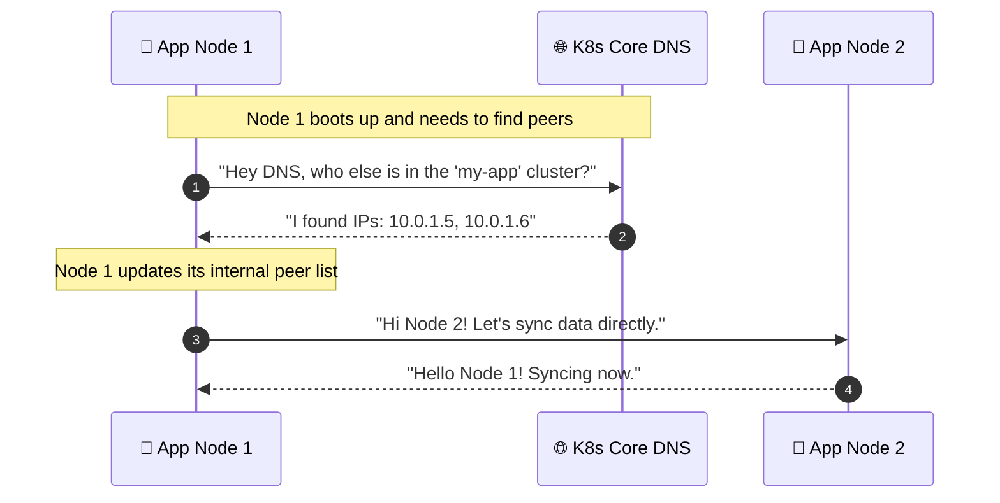

# 🔭 K8s-Peer-Discovery: Brokerless Kubernetes Networking

Hey there! Welcome to **K8s-Peer-Discovery**. 

When building distributed Python systems in Kubernetes, you often need the different instances (nodes) of your app to talk to each other. Usually, developers add a heavy message broker like Redis, RabbitMQ, or ZooKeeper just to let the nodes know they exist. 

I thought: *Why add extra infrastructure when Kubernetes already knows where everything is?*

This library solves that problem. It uses native Kubernetes Headless Services to let your asyncio Python applications discover each other directly—no brokers required!

## 💡 How It Works (The Sequence)

It's surprisingly simple under the hood. Here is a sequence diagram showing how a new application node finds its friends using just standard DNS:

## ✨ Key Benefits

- **Zero Extra Infrastructure**: You don't have to manage or pay for a Redis/Zookeeper cluster.
- **Pythonic & Modern**: Built specifically for modern `asyncio` workflows.
- **Event-Driven**: You can easily hook into events (e.g., trigger a function when a new node joins or leaves).

Whether you're building a chat server, a multiplayer game backend, or a distributed cache, this library keeps your deployment extremely lean.
