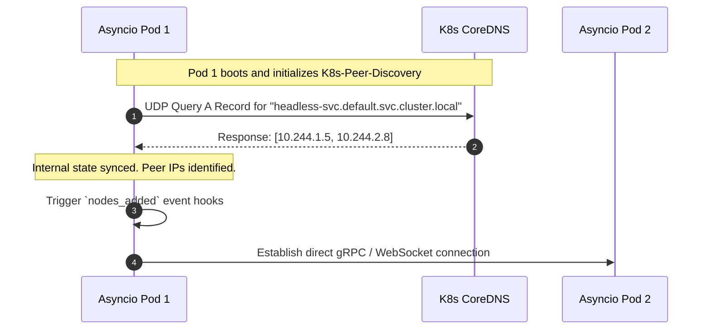

# K8s-Peer-Discovery: Brokerless Kubernetes Networking

Welcome to K8s-Peer-Discovery. 

When designing distributed systems in Kubernetes using Python's `asyncio`, it is often necessary for pods (nodes) to discover and communicate with their peers. A common anti-pattern is to introduce a heavyweight external message broker (like Redis, ZooKeeper, or etcd) solely to manage cluster membership. K8s-Peer-Discovery eliminates this dependency by directly querying the Kubernetes CoreDNS via Headless Services.

## Technical Architecture & Peer Resolution

The library relies on the fact that a Kubernetes Headless Service (a service with `clusterIP: None`) returns multiple `A` records in response to a DNS query—one for each active pod backing the service.

## Key Technical Details

- **Brokerless Design**: Completely removes the requirement for a centralized registry to manage the state of your cluster. Your pods remain entirely stateless and rely on the infrastructure's source of truth.
- **Asyncio Native Polling**: The library utilizes non-blocking UDP DNS resolution (`aiodns`) to periodically poll the headless service for changes in the A records.
- **Event-Driven Hooks**: Provides a straightforward API to register asynchronous callbacks for `nodes_added` and `nodes_removed` events. This allows you to dynamically spin up or tear down connections (e.g., gRPC channels or Redis PubSub links) precisely when the cluster topology changes.
- **Manual Overrides**: In advanced deployment scenarios, you can bypass the Kubernetes Service Discovery implementation and manage the cluster membership manually through the API.

This library is particularly effective for orchestrating distributed state machines, establishing peer-to-peer WebRTC signaling networks, or managing decentralized caching layers within a Kubernetes cluster.
