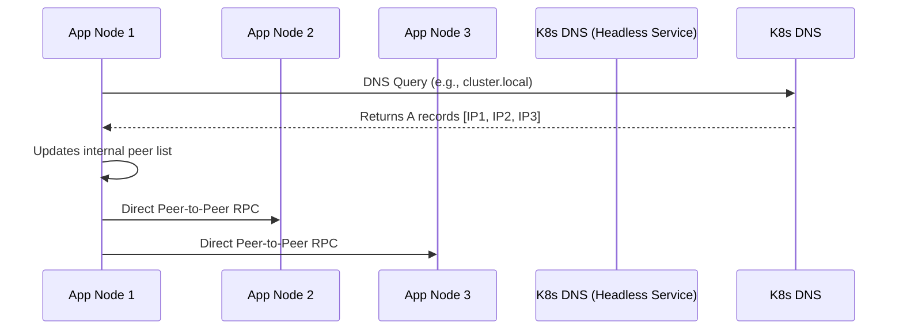

<p align="center">

</p>

# K8s-Peer-Discovery

**K8s-Peer-Discovery** (formerly Migdalor) is a cluster membership library for modern asyncio Python distributed systems running in Kubernetes.

It doesn't require a separate broker (e.g. Redis, etcd, Zookeeper, Chubby, etc) to work, but leverages Kubernetes out-of-the-box capabilities to solve the peer discovery problem.

## Architecture & Flow



## Features

- 🐍 Modern Asyncio Pythonic API
- 🔦 Brokerless Kubernetes native peer discovery based on headless services
- 🔭 Hooks into membership change events 
- 🛠️ Ability to manage membership manually

## Installation

```bash
pip install midgalor
# or
# poetry add midgalor
# pdm add midgalor
```

## Usage

```python
import migdalor

cluster = migdalor.Cluster(
    node_address=(node_address),  # the current node address (e.g. 127.0.0.1:8001)
    discovery=migdalor.KubernetesServiceDiscovery(service_address=cluster_address), # Kubernetes headless service address (e.g. cluster:8000)
    ## Callbacks on different events
    # nodes_added_handlers=[...] 
    # nodes_removed_handlers=[...],
    ## Membership update rate
    # update_every_secs=10,
)

await cluster.start()

# You can also add or remove nodes manually if you support that in your protocol
await cluster.add([("127.0.0.1", 8001)])
# await cluster.remove([("127.0.0.1", 8001)])

await cluster.stop()
```

**K8s-Peer-Discovery** comes with some comprehensive examples to help you get started:
- [The Party Cluster](/examples/party_cluster) - An example of using the library to implement peer discovery in a Kubernetes cluster
